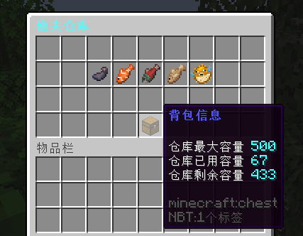
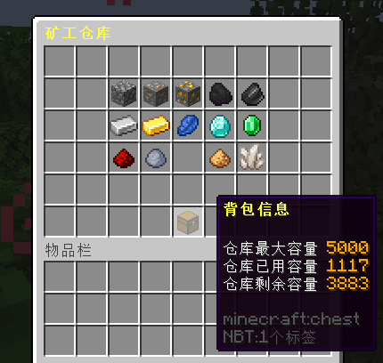
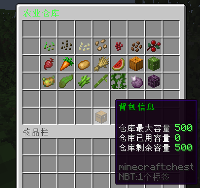
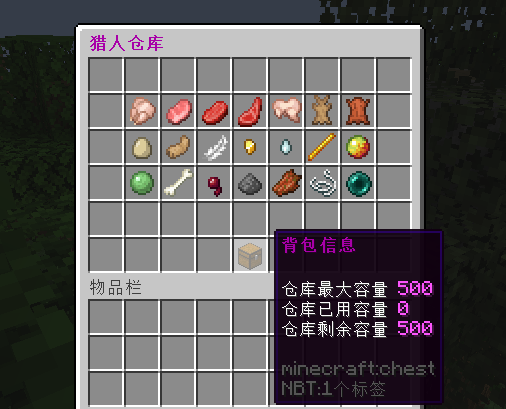

# UltraDepository 预设仓库配置

## 详细示例

您可以 [点击这里](full-example.yml) 查看一份详细的示例。

## 使用须知

预设配置基于 MineCraft 1.16 实现，更低版本可能无法使用。

## 如何使用？

1. 下载并安装 UltraDepository 插件。
2. 启动服务器，配置 `config.yml` 中的一些基础设置。
3. 下载你想要的示例仓库配置文件，并放入 `插件配置目录/depositories` 下。
4. 重启服务器，即可令对应的配置文件生效！

## 预设配置截图

### 渔夫仓库 ([fishman.yml](files/fishman.yml))

### 矿工仓库 ([miner.yml](files/miner.yml))

### 农夫仓库 ([farmer.yml](files/farmer.yml))

### 猎人仓库 ([hunter.yml](files/hunter.yml))

