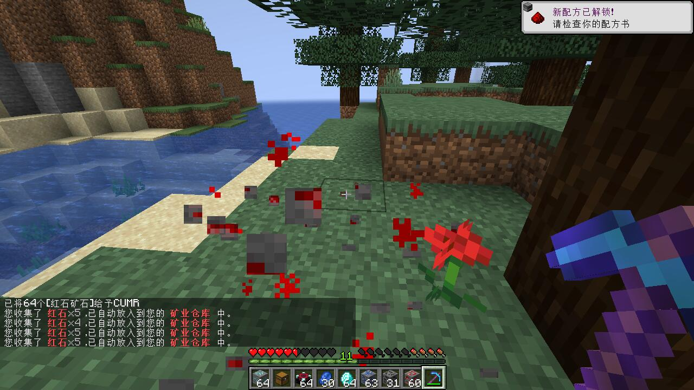
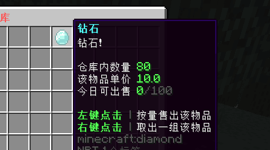
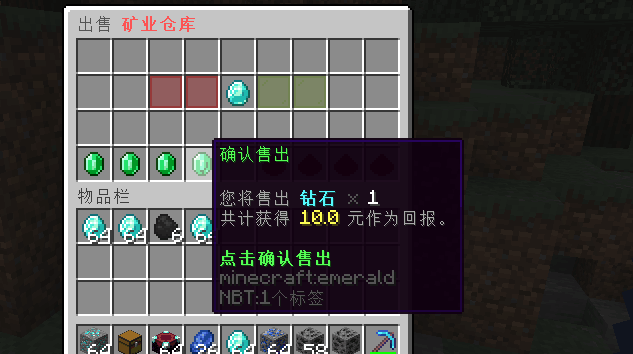
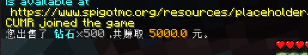

```text
 _    _ _ _             _____                       _ _                   
| |  | | | |           |  __ \                     (_) |                  
| |  | | | |_ _ __ __ _| |  | | ___ _ __   ___  ___ _| |_ ___  _ __ _   _ 
| |  | | | __| '__/ _` | |  | |/ _ \ '_ \ / _ \/ __| | __/ _ \| '__| | | |
| |__| | | |_| | | (_| | |__| |  __/ |_) | (_) \__ \ | || (_) | |  | |_| |
 \____/|_|\__|_|  \__,_|_____/ \___| .__/ \___/|___/_|\__\___/|_|   \__, |
                                   | |                               __/ |
                                   |_|                              |___/ 
```

# UltraDepository

[](https://github.com/CarmJos/UltraDepository/releases)
[](https://opensource.org/licenses/GPL-3.0)
[](https://github.com/CarmJos/UltraDepository/actions/workflows/maven.yml)


超级仓库插件，支持设定不同物品的存储仓库。

本插件基于Spigot实现，**理论上支持全版本**。

本插件由 [墨豆Mordo](https://www.zimrs.cn) 赞助本人开发，经过授权后开源。

## 效果预览

<details>
<summary>收集物品</summary>



</details>

<details>
<summary>仓库界面 (可自定义配置)</summary>



</details>

<details>
<summary>出售界面</summary>




</details>

## 插件依赖

- **[必须]** 插件本体基于 [Spigot-API](https://hub.spigotmc.org/stash/projects/SPIGOT)、[BukkitAPI](http://bukkit.org/) 实现。
- **[自带]** 数据部分基于 [EasySQL](https://github.com/CarmJos/EasySQL) 实现。
    - 本插件连接池使用 [BeeCP](https://github.com/Chris2018998/BeeCP) ，更轻量、快速。
- **[推荐]** 变量部分基于 [PlaceholderAPI](https://www.spigotmc.org/resources/6245/) 实现。
- **[推荐]** 经济部分基于 [VaultAPI](https://github.com/MilkBowl/VaultAPI) 实现。

详细依赖列表可见 [Dependencies](https://github.com/CarmJos/UltraDepository/network/dependencies) 。

## 特殊优势

- 详细的变量与指令！
- 支持多种存储方式！
- 可自定义程度高，配置任何想要的仓库！
- 仓库容量权限配置，可给予特殊用户更大的仓库容量！
- 仓库自动收集物品，提供API操作玩家数据！
- ...

## 插件指令

指令主指令为 /UltraDepository (/ud | /Depository)

<details>
<summary>展开查看所有玩家指令</summary>

```text
# open [仓库ID]
@ 玩家指令 (UltraDepository.use)
- 打开对应仓库的界面。

# sell <仓库ID> <物品ID> <数量>
@ 玩家指令 (UltraDepository.Command.Sell)
- 售出对应数量的对应物品。
- 该指令受到玩家每日售出数量的限制。

# sellAll [仓库ID] [物品ID]
@ 玩家指令 (UltraDepository.Command.SellAll)
- 售出所有相关物品。
- 该指令受到玩家每日售出数量的限制。
```

</details>

<details>
<summary>展开查看所有后台指令</summary>

以下指令**只有后台**才可以使用，可用于搭配变量自制玩家管理GUI。

```text
# info <玩家> [仓库ID] [物品ID]
- 得到玩家的相关物品信息。

# add <玩家> <仓库ID> <物品ID> <数量>
- 为玩家添加对应仓库中对于物品的数量。

# remove <玩家> <仓库ID> <物品ID> [数量]
- 为玩家减少对应仓库中对于物品的数量。
- 若不填写数量，则清空对应仓库的对应物品。

# sell <玩家> [仓库ID] [物品ID] [数量]
- 为玩家售出相关物品。
- 若不填写数量，则售出所有对应仓库的对应物品。
- 若不填写物品，则售出对应仓库内所有物品。
- 若不填写仓库，则售出所有仓库内所有物品。
- 该指令受到玩家每日售出数量的限制。
```

</details>

## 插件变量 ([PlaceholderAPI](https://www.spigotmc.org/resources/6245/))

变量部分基于 [PlaceholderAPI](https://www.spigotmc.org/resources/6245/) 实现，如需使用变量请安装其插件。

<details>
<summary>展开查看所有变量</summary>

```text
# %UltraDepository_amount_<仓库ID>_<物品ID>%
- 得到对应仓库内对应物品的数量

# %UltraDepository_price_<仓库ID>_<物品ID>%
- 得到对应仓库内对应物品的价格

# %UltraDepository_sold_<仓库ID>_<物品ID>%
- 得到对应仓库内对应物品的今日售出数量

# %UltraDepository_limit_<仓库ID>_<物品ID>%
- 得到对应仓库内对应物品的每日售出限制

# %UltraDepository_remain_<仓库ID>_<物品ID>%
- 得到对应仓库内对应物品的剩余可售出数量
- $剩余可售出数量 = $每日售出限制 - $今日售出数量

# %UltraDepository_capacity_<仓库ID>%
- 得到对应仓库的容量

# %UltraDepository_used_<仓库ID>%
- 得到已使用的仓库容量

# %UltraDepository_usable_<仓库ID>%
- 得到剩余可使用的仓库容量

```

</details>

## 插件权限

<details>
<summary>展开查看所有权限</summary>

```text

# UltraDepository.use
- 超级仓库的基本使用权限 (默认所有人都有)

# UltraDepository.Command.Sell
- 玩家使用Sell指令的权限

# UltraDepository.Command.SellAll
- 玩家使用SellAll指令的权限

# UltraDepository.auto
- 超级仓库的自动收集权限

# UltraDepository.auto.enable
- 用于判断是否启用了自动收集功能
- 您可以自己使用GUI创建一个按钮，后通过给玩家添加/删除该权限决定玩家是否开启自动收集。

# UltraDepository.admin
- "超级仓库的管理权限"

```

</details>

## 配置文件

### [插件配置文件](src/main/resources/config.yml) (config.yml)

详见源文件。

### [消息配置文件](src/main/resources/messages.yml) (messages.yml)

详见源文件。

### 仓库配置文件 (depositories/<ID>.yml)

所有仓库配置均为单独的配置文件，存放于 `插件配置目录/depositories` 下，便于管理。

文件名即仓库的ID，理论上可以随便取，但**强烈推荐**使用纯英文，部分符号可能会影响正常读取，请避免使用。

这里准备了几个常用的仓库类型，可以 [在这里](.examples/depositories) 找到您需要的直接使用或加以修改后使用。

您也可以查看下方的示例，看到所有相关的配置，以制作您自己的仓库。
<details>
<summary>展开查看示例仓库配置</summary>

```yaml

name: "&b&l示例仓库" # 仓库名，用于消息显示

capacity: # 容量配置
  default: 500 # 若为0则默认不可以使用该仓库
  permissions: # 特殊权限对应的仓库容量，格式为 "权限:容量
    - "UltraDepository.vip:1000"
    - "UltraDepository.mvp:1500"

gui: # GUI额外配置
  title: "&b&l示例仓库 &7| 界面" #示例仓库的GUI标题
  lines: 4 # GUI的行数，支持 1-6行。
  items:
    "TEST":
      material: CHEST # 物品图标的类型
      data: 0 # 物品图标的数据值
      slot: 31 # 在GUI中显示的格子
      name: "&9&l测试图标"
      lore:
        # 支持使用变量
        - "你好 %player_name% !"
      actions: # 物品点击操作
        - "[CHAT] Hello!" #以玩家身份发送Hello，支持PlaceholderAPI变量
        - "[CHAT] /help" #若内容以"/"开头，则会以玩家身份执行指令,支持PlaceholderAPI变量
        - "[CONSOLE] say HELLO WORLD" #以后台身份执行指令，不需要加"/"，支持PlaceholderAPI变量
        - "[MESSAGE] &(#FFBBBBB)Test %player_name%" # 向玩家发送消息，支持PlaceholderAPI变量和RGB颜色
        - "[SOUND] ENTITY_EXPERIENCE_ORB_PICKUP:0.5" # 向玩家发送声音，可以规定音量大小和音调，格式为 <声音>:[音量]:[音调]
        - "[CLOSE]" # 为玩家关闭界面

        - "[LEFT:CLOSE]" #限制只有 鼠标左键 才触发CLOSE
        - "[SHIFT_LEFT:CLOSE]" #限制只有 按住Shift+鼠标左键 才触发CLOSE
        - "[RIGHT:CLOSE]" #限制只有 鼠标右键 才触发CLOSE
        - "[SHIFT_RIGHT:CLOSE]" #限制只有 按住Shift+鼠标右键 才触发CLOSE
        - "[MIDDLE:CLOSE]" #限制只有 鼠标中键 才触发CLOSE
        - "[DROP:CLOSE]" #限制只有 丢弃建 才触发CLOSE
        - "[CONTROL_DROP:CLOSE]" #限制只有 按住Ctrl+丢弃键 才触发CLOSE
        - "[DOUBLE_CLICK:CLOSE]" #限制只有 鼠标双击物品 才触发CLOSE
        - "[NUMBER_KEY:CLOSE]" #限制只有 数字键切换 才触发CLOSE

items:
  "INK_SAC": #物品ID，若需要限制数据ID则可以加“:”,如 "INK_SANK:4" 
    slot: 11 # 物品在GUI中显示的槽位
    price: 0.1 # 物品单价
    limit: 500 # 物品每日售出限制
    name: "&8&l墨囊" # 物品显示的名字
    lore: # 物品的lore
      - " "
      - "&f抓住墨鱼！"

```

</details>

## 支持与捐赠

若您觉得本插件做的不错，您可以捐赠支持我！


## 开源协议

本项目源码采用 [GNU General Public License v3.0](https://opensource.org/licenses/GPL-3.0) 开源协议。

<details>
<summary>关于 GPL 协议</summary>

> GNU General Public Licence (GPL) 有可能是开源界最常用的许可模式。GPL 保证了所有开发者的权利，同时为使用者提供了足够的复制，分发，修改的权利：
>
> #### 可自由复制
> 你可以将软件复制到你的电脑，你客户的电脑，或者任何地方。复制份数没有任何限制。
> #### 可自由分发
> 在你的网站提供下载，拷贝到U盘送人，或者将源代码打印出来从窗户扔出去（环保起见，请别这样做）。
> #### 可以用来盈利
> 你可以在分发软件的时候收费，但你必须在收费前向你的客户提供该软件的 GNU GPL 许可协议，以便让他们知道，他们可以从别的渠道免费得到这份软件，以及你收费的理由。
> #### 可自由修改
> 如果你想添加或删除某个功能，没问题，如果你想在别的项目中使用部分代码，也没问题，唯一的要求是，使用了这段代码的项目也必须使用 GPL 协议。
>
> 需要注意的是，分发的时候，需要明确提供源代码和二进制文件，另外，用于某些程序的某些协议有一些问题和限制，你可以看一下 @PierreJoye 写的 Practical Guide to GPL Compliance 一文。使用 GPL 协议，你必须在源代码代码中包含相应信息，以及协议本身。
>
> *以上文字来自 [五种开源协议GPL,LGPL,BSD,MIT,Apache](https://www.oschina.net/question/54100_9455) 。*
</details>
